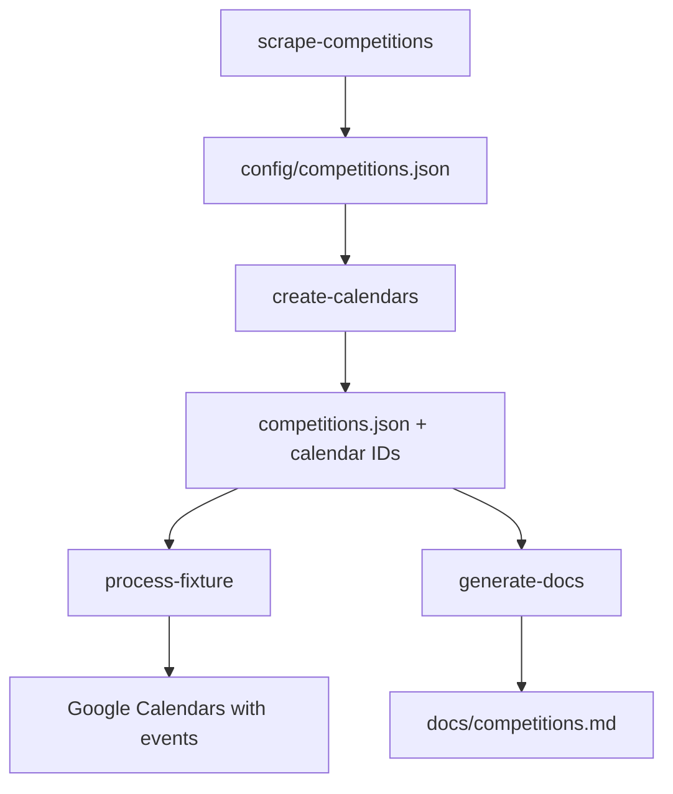

# Hockey Victoria Calendar Setup Scripts

This directory contains setup and utility scripts for managing Hockey Victoria competition calendars and Google Calendar integration.

## 📋 Available Scripts

### Core Scripts

| Script | Command | Description |
|--------|---------|-------------|
| **Competition Scraper** | `npm run scrape-competitions` | Scrapes Hockey Victoria for competitions containing Footscray Hockey Club |
| **Calendar Creator** | `npm run create-calendars` | Creates Google Calendars for each competition |
| **Calendar Lister** | `npm run list-calendars` | Lists existing Google Calendars |
| **Calendar Exporter** | `npm run export-calendars` | Exports calendar data to JSON |
| **Calendar Deleter** | `npm run delete-calendars` | Deletes Google Calendars (with safety prompts) |
| **Documentation Generator** | `npm run generate-docs` | Generates markdown documentation with calendar links |

### Workflow Scripts

| Script | Command | Description |
|--------|---------|-------------|
| **Process Fixture** | `npm run process-fixture` | Main workflow: download, process, and upload calendars |

## 🚀 Quick Start

### Prerequisites

1. **Google Calendar API Setup**
   - Create a Google Cloud Project
   - Enable Google Calendar API
   - Create a Service Account
   - Download service account key as `service-account-key.json` in project root

2. **Node.js Dependencies**
   ```bash
   npm install
   ```

### Basic Workflow

1. **Scrape Competitions**
   ```bash
   npm run scrape-competitions
   ```
   - Discovers all competitions containing Footscray Hockey Club
   - Saves results to `config/competitions.json`
   - Supports resuming from interruptions

2. **Create Google Calendars**
   ```bash
   npm run create-calendars
   ```
   - Creates public Google Calendars for each competition
   - Updates `competitions.json` with calendar IDs
   - Skips existing calendars

3. **Process and Upload Fixtures**
   ```bash
   npm run process-fixture -- --all
   ```
   - Downloads iCal files from Hockey Victoria
   - Processes and enhances calendar events
   - Uploads to Google Calendars

4. **Generate Documentation**
   ```bash
   npm run generate-docs
   ```
   - Creates `docs/competitions.md` with calendar subscribe links
   - Organized by category (Men's, Women's, Midweek, Juniors)

## 📖 Script Documentation

### Competition Scraper (`scrape-competitions`)

Discovers competitions by scraping Hockey Victoria's games pages.

**Usage:**
```bash
npm run scrape-competitions [-- options]
```

**Options:**
- `--force, -f` - Restart from scratch (ignore saved progress)
- `--help, -h` - Show help

**Features:**
- **3-layer navigation**: Games page → Competition page → Ladder page
- **Parallel processing**: Up to 5 competitions simultaneously
- **Progress tracking**: Resume from interruptions
- **Smart filtering**: Only includes pages with Footscray Hockey Club

**Output:**
- `config/competitions.json` - Competition data with fixture/ladder URLs
- `temp/scraper-progress.json` - Progress tracking

---

### Calendar Creator (`create-calendars`)

Creates Google Calendars for competitions.

**Usage:**
```bash
npm run create-calendars [-- options]
```

**Options:**
- `--help, -h` - Show help

**Features:**
- **Duplicate detection**: Skips existing calendars with same names
- **Public calendars**: Creates publicly accessible calendars
- **Rate limiting**: Respects Google API limits
- **Metadata updates**: Updates `competitions.json` with calendar info

**Requirements:**
- `service-account-key.json` in project root
- Google Calendar API enabled
- Service account with calendar creation permissions

---

### Calendar Management

#### List Calendars (`list-calendars`)

**Usage:**
```bash
npm run list-calendars [-- options]
```

**Options:**
- `--all` - Show all calendars
- `--filter <prefix>` - Filter by prefix (default: "FHC ")
- `--stats` - Show calendar statistics
- `--help, -h` - Show help

#### Export Calendars (`export-calendars`)

**Usage:**
```bash
npm run export-calendars [-- options]
```

**Options:**
- `--export <file>` - Export filename (default: exported-calendars.json)
- `--all` - Export all calendars
- `--filter <prefix>` - Filter by prefix

#### Delete Calendars (`delete-calendars`)

**Usage:**
```bash
npm run delete-calendars [-- options]
```

**Options:**
- `--all` - Delete all FHC calendars
- `--pattern <pattern>` - Delete calendars matching pattern
- `--name <name>` - Delete specific calendar by name
- `--help, -h` - Show help

**Safety Features:**
- Interactive confirmation required
- Multiple deletion methods
- Cannot recover deleted calendars

---

### Documentation Generator (`generate-docs`)

**Usage:**
```bash
npm run generate-docs [-- options]
```

**Options:**
- `--help, -h` - Show help

**Features:**
- **Auto-categorization**: Groups by Men's, Women's, Midweek, Juniors
- **Table format**: Clean markdown tables with subscribe links
- **Order preservation**: Maintains JSON file order
- **Live updates**: Shows last updated timestamp

**Output:**
- `docs/competitions.md` - Formatted documentation

## 🗂️ File Structure

```
setup/
├── shared/                          # Shared utilities
│   ├── google-auth.js              # Google Calendar authentication
│   ├── config.js                   # Shared configuration constants
│   ├── competition-utils.js        # Competition data utilities
│   └── error-utils.js              # Error handling utilities
├── competition-scraper.js          # Competition discovery
├── create-google-calendars.js      # Calendar creation
├── delete-google-calendars.js      # Calendar deletion
├── list-google-calendars.js        # Calendar listing/export
├── generate-docs.js               # Documentation generation
└── README.md                      # This file
```

## ⚙️ Configuration

### Shared Configuration (`shared/config.js`)

Key constants used across all scripts:

```javascript
// File paths
COMPETITIONS_FILE = 'config/competitions.json'
SERVICE_ACCOUNT_KEY = 'service-account-key.json'

// Google Calendar
CALENDAR_PREFIX = 'FHC '
SCOPES = ['https://www.googleapis.com/auth/calendar']

// Hockey Victoria
BASE_URL = 'https://www.hockeyvictoria.org.au/games/'
CLUB_NAME = 'Footscray Hockey Club'
```

### Competition Categories

Competitions are automatically categorized:

- **Midweek**: Contains "midweek"
- **Juniors**: Contains "u12", "u14", "u16", "u18", or "mixed"
- **Women's**: Contains "women's" or "women "
- **Men's**: Contains "men's" or "men "

## 🔧 Troubleshooting

### Common Issues

**Authentication Errors**
- Ensure `service-account-key.json` exists in project root
- Verify Google Calendar API is enabled
- Check service account permissions

**Rate Limiting**
- Scripts include automatic retry with exponential backoff
- API limits typically reset within minutes

**Missing Competitions**
- Run `npm run scrape-competitions --force` to refresh data
- Check Hockey Victoria website accessibility

**File Not Found Errors**
- Ensure dependencies are run in order: scrape → create → process
- Check file paths in error messages

### Getting Help

Each script includes detailed help:
```bash
npm run <script-name> -- --help
```

## 📊 Data Flow



## 🔄 Maintenance

### Regular Tasks

1. **Monthly**: Refresh competition data
   ```bash
   npm run scrape-competitions --force
   ```

2. **Weekly**: Update fixture calendars
   ```bash
   npm run process-fixture -- --all
   ```

3. **As needed**: Update documentation
   ```bash
   npm run generate-docs
   ```

### Cleanup

- **Temp files**: Automatically managed by `process-fixture`
- **Old calendars**: Use `delete-calendars` for bulk removal
- **Progress files**: Safe to delete `temp/scraper-progress.json` to restart scraping

## 📈 Performance

- **Concurrent processing**: 5 simultaneous operations
- **Progress saving**: Resume interrupted operations
- **Rate limiting**: Respects Google API limits
- **Efficient caching**: Avoids redundant API calls

---

*This documentation is automatically maintained and updated with each script modification.*