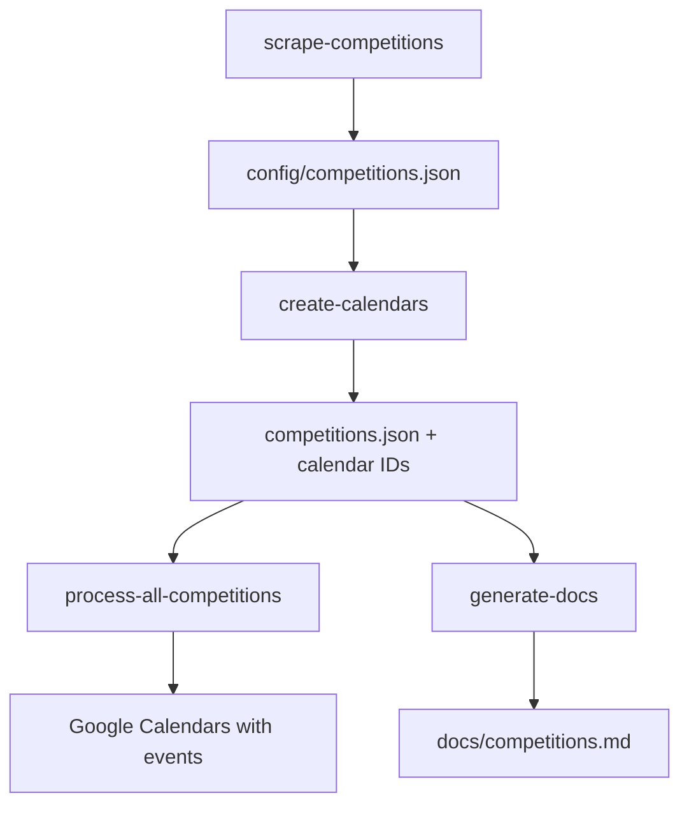

# Hockey Victoria Calendar Setup Scripts

This directory contains scripts for improving Hockey Victoria competition calendars. 

Improvements:
* Fixtures in Google Calendar, updated daily to capture any scheduling changes (time, location, etc)
* Simplified Calendar names i.e. `FHC Men - PL`
* Simplified Round names i.e. 
  * From: `2025 Senior Competition Men's Premier League - 2025 Round 18 - Footscray Hockey Club vs Camberwell Hockey Club`
  * To: `PL - FHC vs CAM`
* Links to relevant HV pages: Full Fixture, Ladder, Current Round

## 📋 Available Scripts

### Core Scripts

| Script | Command | Description |
|--------|---------|-------------|
| **Competition Scraper** | `npm run scrape-competitions` | Scrapes Hockey Victoria for competitions containing Footscray Hockey Club |
| **Calendar Creator** | `npm run create-calendars` | Creates Google Calendars for each competition |
| **Calendar Lister** | `npm run list-calendars` | Lists existing Google Calendars |
| **Calendar Exporter** | `npm run export-calendars` | Exports calendar data to JSON |
| **Calendar Deleter** | `npm run delete-calendars` | Deletes Google Calendars (with safety prompts) |
| **Documentation Generator** | `npm run generate-docs` | Generates markdown documentation with calendar links |
| **Club Mappings Updater** | `npm run update-mappings-club-names` | Updates club name mappings from ladder data |

### Workflow Scripts

| Script | Command | Description |
|--------|---------|-------------|
| **Process All Competitions** | `npm run process-all-competitions` | Process all competitions: download, process, and upload calendars |
| **Process Competition** | `npm run process-competition` | Process a single competition's calendar |

## 🚀 Quick Start

### Prerequisites

1. **Configuration Setup**
   - Edit `config/settings.json` to configure your club:
     ```json
     {
       "clubName": "Footscray Hockey Club",
       "calendarPrefix": "FHC "
     }
     ```
   - **clubName**: Full name of your hockey club (used for scraping competitions)
   - **calendarPrefix**: Prefix for Google Calendar names (keeps calendars organized)

2. **Google Calendar API Setup**
   - Create a Google Cloud Project
   - Enable Google Calendar API
   - Create a Service Account
   - Download service account key as `service-account-key.json` in project root

3. **Node.js Dependencies**
   ```bash
   npm install
   ```

### Basic Workflow

1. **Scrape Competitions**
   ```bash
   npm run scrape-competitions
   ```
   - Discovers all competitions containing your configured club
   - Saves results to `config/competitions.json`
   - Supports resuming from interruptions

2. **Update Club Mappings**
   ```bash
   npm run update-mappings-club-names
   ```
   - Discovers all Clubs names for you competitions
   - Saves results to `config/mappings-club-names.json`
   - Review the file for new nmes and abbreviations

3. **Create Google Calendars**
   ```bash
   npm run create-calendars
   ```
   - Creates public Google Calendars for each competition
   - Updates `competitions.json` with calendar IDs
   - Skips existing calendars

4. **Process and Upload Fixtures**
   ```bash
   # Process all competitions
   npm run process-all-competitions -- --all
   
   # Or process a single competition
   npm run process-competition -- "Men's Premier League - 2025"
   ```
   - Downloads iCal files from Hockey Victoria
   - Processes and enhances calendar events
   - Uploads to Google Calendars

5. **Generate Documentation**
   ```bash
   npm run generate-docs
   ```
   - Creates `docs/competitions.md` with calendar subscribe links
   - Organized by category (Men's, Women's, Midweek, Juniors)

## 📖 Script Documentation

### Competition Scraper (`scrape-competitions`)

Discovers competitions by scraping Hockey Victoria's games pages.

**Usage:**
```bash
npm run scrape-competitions [-- options]
```

**Options:**
- `--use-progress, -p` - Resume from saved progress if available
- `--help, -h` - Show help

**Features:**
- **3-layer navigation**: Games page → Competition page → Ladder page
- **Parallel processing**: Up to 5 competitions simultaneously
- **Progress tracking**: Resume from interruptions
- **Smart filtering**: Only includes pages with your configured club

**Output:**
- `config/competitions.json` - Competition data with fixture/ladder URLs
- `temp/scraper-progress.json` - Progress tracking

---

### Process Competition (`process-competition`)

Processes fixtures for a single competition instead of processing all competitions.

**Usage:**
```bash
npm run process-competition [-- options]
npm run process-competition -- "Competition Name"
npm run process-competition -- --competition "Competition Name" --steps download,process
```

**Options:**
- `--competition, -c <name>` - Competition name to update
- `--all` - Run all steps (download, process, upload) [default]
- `--steps <steps>` - Comma-separated list of steps (download, process, upload)
- `--use-cache` - Use cached results from previous runs
- `--list, -l` - List all available competitions
- `--help, -h` - Show help

**Features:**
- **Interactive Selection**: Choose from categorized competition list
- **Visual Indicators**: Shows ✅ for competitions with calendars, ❌ without
- **Flexible Name Matching**: Supports partial name matching
- **Targeted Updates**: Update single competitions without processing all
- **Faster Processing**: Only processes selected competition

**Examples:**
```bash
# Interactive competition selection
npm run process-competition

# List all available competitions
npm run process-competition -- --list

# Process specific competition
npm run process-competition -- "Men's Premier League - 2025"

# Process with specific steps (runs fresh by default)
npm run process-competition -- -c "U16 Girls Pennant NW - 2025"

# Download and process only (skip upload)
npm run process-competition -- "Women's Pennant A - 2025" --steps download,process
```

**Use Cases:**
- Fix individual competition issues without reprocessing all
- Test changes on a single competition
- Update newly added competitions
- Recover from upload failures for specific competitions

---

### Process All Competitions (`process-all-competitions`)

Main workflow to download, process, and upload all competition calendars.

**Usage:**
```bash
npm run process-all-competitions [-- options]
```

**Options:**
- `--all` - Run all steps (download, process, upload)
- `--steps <steps>` - Comma-separated list of steps
- `--use-cache` - Use cached results from previous runs
- `--help, -h` - Show help

**Features:**
- **Interactive Mode**: Menu-driven step selection (default)
- **Batch Processing**: Handles all competitions at once
- **Step Caching**: Resumes from previous successful steps
- **Progress Tracking**: Shows success/failure for each competition

**Examples:**
```bash
# Interactive mode (choose steps from menu)
npm run process-all-competitions

# Run all steps
npm run process-all-competitions -- --all

# Run specific steps
npm run process-all-competitions -- --steps download
npm run process-all-competitions -- --steps download,process

# Re-run all steps (default behavior)
npm run process-all-competitions -- --all
```

---

### Calendar Creator (`create-calendars`)

Creates Google Calendars for competitions.

**Usage:**
```bash
npm run create-calendars [-- options]
```

**Options:**
- `--help, -h` - Show help

**Features:**
- **Duplicate detection**: Skips existing calendars with same names
- **Public calendars**: Creates publicly accessible calendars
- **Rate limiting**: Respects Google API limits
- **Metadata updates**: Updates `competitions.json` with calendar info

**Requirements:**
- `service-account-key.json` in project root
- Google Calendar API enabled
- Service account with calendar creation permissions

---

### Calendar Management

#### List Calendars (`list-calendars`)

**Usage:**
```bash
npm run list-calendars [-- options]
```

**Options:**
- `--all` - Show all calendars
- `--filter <prefix>` - Filter by prefix (default: configured calendar prefix)
- `--stats` - Show calendar statistics
- `--help, -h` - Show help

#### Export Calendars (`export-calendars`)

**Usage:**
```bash
npm run export-calendars [-- options]
```

**Options:**
- `--export <file>` - Export filename (default: exported-calendars.json)
- `--all` - Export all calendars
- `--filter <prefix>` - Filter by prefix

#### Delete Calendars (`delete-calendars`)

**Usage:**
```bash
npm run delete-calendars [-- options]
```

**Options:**
- `--all` - Delete all calendars with configured prefix
- `--pattern <pattern>` - Delete calendars matching pattern
- `--name <name>` - Delete specific calendar by name
- `--help, -h` - Show help

**Safety Features:**
- Interactive confirmation required
- Multiple deletion methods
- Cannot recover deleted calendars

---

### Documentation Generator (`generate-docs`)

**Usage:**
```bash
npm run generate-docs [-- options]
```

**Options:**
- `--help, -h` - Show help

**Features:**
- **Auto-categorization**: Groups by Men's, Women's, Midweek, Juniors
- **Table format**: Clean markdown tables with subscribe links
- **Order preservation**: Maintains JSON file order
- **Live updates**: Shows last updated timestamp

**Output:**
- `docs/competitions.md` - Formatted documentation

---

### Club Mappings Updater (`update-mappings-club-names`)

Scans ladder URLs from competitions.json and automatically adds missing club names to mappings-club-names.json.

**Usage:**
```bash
npm run update-mappings-club-names [-- options]
```

**Options:**
- `--dry-run, -d` - Show what would be added without making changes
- `--dry-run, -d` - Preview changes without saving
- `--help, -h` - Show help

**Features:**
- **Automated Discovery**: Scrapes club names from Hockey Victoria ladder pages
- **Smart Abbreviations**: Generates unique abbreviations automatically
- **Duplicate Prevention**: Ensures abbreviations are unique
- **Dry Run Mode**: Preview changes before applying
- **Progress Tracking**: Shows detailed progress and results

**How it works:**
1. Loads existing club mappings from `config/mappings-club-names.json`
2. Scans each competition's ladder URL using Puppeteer
3. Extracts club names from ladder tables
4. Generates unique abbreviations for new clubs
5. Updates the mappings file with new entries

**Examples:**
```bash
# Update mappings with new clubs
npm run update-mappings-club-names

# Preview what would be added
npm run update-mappings-club-names -- --dry-run

# Update mappings with new clubs
npm run update-mappings-club-names
```

**Use Cases:**
- Initial setup to populate club mappings
- Periodic updates when new clubs join competitions
- Maintenance after adding new competitions to competitions.json
- Fixing missing club abbreviations in calendar processing

**Requirements:**
- Valid ladder URLs in competitions.json
- Internet connection to access Hockey Victoria website
- Puppeteer for web scraping

## 🗂️ File Structure

```
src/
├── lib/                             # Shared utilities
│   ├── google-auth.js              # Google Calendar authentication
│   ├── config.js                   # Shared configuration constants
│   ├── competition-utils.js        # Competition data utilities
│   └── error-utils.js              # Error handling utilities
├── setup/                           # Setup and utility scripts
│   ├── competition-scraper.js      # Competition discovery
│   ├── create-google-calendars.js  # Calendar creation
│   ├── delete-google-calendars.js  # Calendar deletion
│   ├── list-google-calendars.js    # Calendar listing/export
│   ├── generate-docs.js           # Documentation generation
│   └── update-mappings-club-names.js # Club mappings updater
└── tasks/                           # Task workflow scripts
    ├── index.js                    # Main workflow orchestration
    ├── process-competition.js      # Single competition processor
    ├── fixture-processor.js        # Shared processing logic
    ├── calendar-downloader.js      # Calendar downloading
    ├── calendar-processor.js       # Calendar processing
    └── google-calendar.js          # Google Calendar integration
```

## ⚙️ Configuration

### Club Configuration (`config/settings.json`)

**Required**: Configure your club details before using the scripts:

```json
{
  "clubName": "Your Hockey Club Name",
  "calendarPrefix": "YHC "
}
```

**Settings Impact:**
- **clubName**: Used by the competition scraper to find your club in Hockey Victoria competitions. Must exactly match your club name as it appears on the Hockey Victoria website.
- **calendarPrefix**: Added to the beginning of all Google Calendar names (e.g., "YHC Men's Pennant A Grade"). Keeps your calendars organized and easily identifiable.

### Internal Configuration (`src/lib/config.js`)

Technical constants used across all scripts:

```javascript
// File paths
COMPETITIONS_FILE = 'config/competitions.json'
SERVICE_ACCOUNT_KEY = 'service-account-key.json'

// Google Calendar
SCOPES = ['https://www.googleapis.com/auth/calendar']

// Hockey Victoria
BASE_URL = 'https://www.hockeyvictoria.org.au/games/'
```

### Competition Categories

Competitions are automatically categorized:

- **Midweek**: Contains "midweek"
- **Juniors**: Contains "u12", "u14", "u16", "u18", or "mixed"
- **Women's**: Contains "women's" or "women "
- **Men's**: Contains "men's" or "men "

## 🔧 Troubleshooting

### Common Issues

**Authentication Errors**
- Ensure `service-account-key.json` exists in project root
- Verify Google Calendar API is enabled
- Check service account permissions

**Rate Limiting**
- Scripts include automatic retry with exponential backoff
- API limits typically reset within minutes

**Missing Competitions**
- Run `npm run scrape-competitions` to refresh data (starts fresh by default)
- Check Hockey Victoria website accessibility

**File Not Found Errors**
- Ensure dependencies are run in order: scrape → create → process
- Check file paths in error messages

**Upload Failures for Specific Competitions**
- Use `npm run process-competition` to retry individual competitions
- By default, all steps are re-run from scratch
- Add `--use-cache` flag to use cached results: `npm run process-competition -- "Competition Name" --use-cache`
- Common after creating new calendars - cached results may not have calendar IDs

**"No Google Calendar IDs specified" Error**
- Occurs when using cached results from before calendars were created
- Solution: `npm run process-competition -- "Competition Name"` (runs fresh by default)
- Or clear cache: `rm temp/step-results.json`

### Getting Help

Each script includes detailed help:
```bash
npm run <script-name> -- --help
```

## 📊 Data Flow



## 🔄 Maintenance

### Regular Tasks

1. **Monthly**: Refresh competition data
   ```bash
   npm run scrape-competitions
   ```

2. **Weekly**: Update fixture calendars
   ```bash
   npm run process-all-competitions -- --all
   ```

3. **As needed**: Update documentation
   ```bash
   npm run generate-docs
   ```

### Cleanup

- **Temp files**: Automatically managed by `process-all-competitions`
- **Old calendars**: Use `delete-calendars` for bulk removal
- **Progress files**: Safe to delete `temp/scraper-progress.json` to restart scraping

## 📈 Performance

- **Concurrent processing**: 5 simultaneous operations
- **Progress saving**: Resume interrupted operations
- **Rate limiting**: Respects Google API limits
- **Efficient caching**: Avoids redundant API calls

---

*This documentation is automatically maintained and updated with each script modification.*