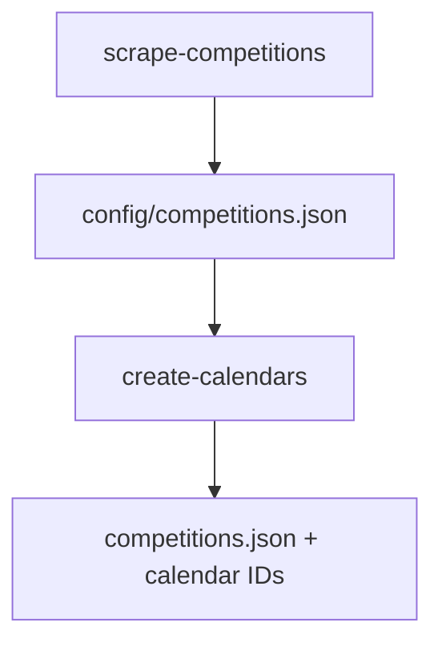
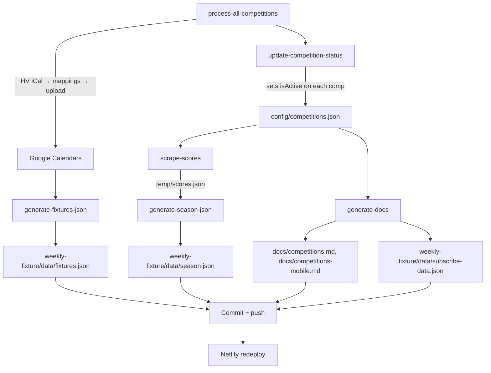

# Hockey Victoria Improved Club Calendars

This project contains scripts for improving Hockey Victoria competition calendars.

[](https://github.com/mawiseman/hockey-victoria-club-calendars/actions/workflows/sync-calendars.yml)

- [View Available Calendars](https://github.com/mawiseman/hockey-victoria-club-calendars/blob/main/docs/competitions.md)
- [View Available Calendars (Mobile Friendly)](https://github.com/mawiseman/hockey-victoria-club-calendars/blob/main/docs/competitions-mobile.md)

Improvements:
* Fixtures in Google Calendar, updated daily to capture any scheduling changes (time, location, etc)
* Simplified Calendar names i.e. `FHC Men - PL`
* Simplified Round names i.e.
  * From: `2025 Senior Competition Men's Premier League - 2025 Round 18 - Footscray Hockey Club vs Camberwell Hockey Club`
  * To: `PL - FHC vs CAM`
* Links to relevant HV pages: Full Fixture, Ladder, Current Round

## 📋 Available Scripts

### Setup / New Season Scripts

| Script | Command | Description |
|--------|---------|-------------|
| **Update Competition Status** | `npm run update-competition-status` | Checks processed calendars and marks competitions as active/inactive |
| **Cleanup Inactive** | `npm run cleanup-inactive` | Remove inactive competitions from tracking |
| **Competition Scraper** | `npm run scrape-competitions` | Scrapes Hockey Victoria for competitions containing Footscray Hockey Club |
| **Calendar Creator** | `npm run create-calendars` | Creates Google Calendars for each competition and combined category calendars (Men's, Women's, etc.) |
| **Club Mappings Updater** | `npm run update-mappings-club-names` | Updates club name mappings from ladder data |
| **Documentation Generator** | `npm run generate-docs` | Generates markdown documentation with calendar links |

### Workflow Scripts

| Script | Command | Description |
|--------|---------|-------------|
| **Process All Competitions** | `npm run process-all-competitions` | Process all competitions: download, process, and upload to individual + category calendars |
| **Process Competition** | `npm run process-competition` | Process a single competition's calendar |
| **Scrape Scores** | `npm run scrape-scores` | Pulls match scores from each active team page into `temp/scores.json` (used by `generate-season-json`) |

### Weekly Fixture Site Generators

The site at [weekly-fixture/](./weekly-fixture/) reads three pre-built JSON files committed to the repo. Each is regenerated by its own script:

| Script | Command | Output |
|--------|---------|--------|
| **Fixtures JSON** | `npm run generate-fixtures-json` | `weekly-fixture/data/fixtures.json` — week view (fetches the four category Google Calendar iCal feeds server-side) |
| **Season JSON** | `npm run generate-season-json` | `weekly-fixture/data/season.json` — team-season view (combines `temp/scores.json` with `config/competitions.json`) |
| **OG Image** | `npm run generate-og-image` | `weekly-fixture/images/og-image.png` — social-card preview, rendered from `weekly-fixture/src/og-card.html` |

`generate-docs` (above) also writes `weekly-fixture/data/subscribe-data.json` for the subscribe page.

### Calendar Utilities Scripts

| Script | Command | Description |
|--------|---------|-------------|
| **Calendar Lister** | `npm run list-calendars` | Lists existing Google Calendars |
| **Calendar Exporter** | `npm run export-calendars` | Exports calendar data to JSON |
| **Calendar Deleter** | `npm run delete-calendars` | Deletes Google Calendars (with safety prompts) |

### Test Scripts

| Script | Command | Description |
|--------|---------|-------------|
| **Calendar Summary Test** | `npm run test-calendar-summary-processing` | Tests calendar summary name processing against downloaded ICS files |

## 🎯 Usage Guide

### First Time Setup

Complete these steps when setting up the project for the first time.

#### Prerequisites

See [Setup Guide](./docs/setup.md) for detailed setup instructions including Google Calendar API configuration and service account setup.

#### Initial Data Collection

1. **Scrape Competitions**
   ```bash
   npm run scrape-competitions
   ```
   - Discovers all competitions containing your configured club
   - Saves results to `config/competitions.json`
   - Supports resuming from interruptions

2. **Update Club Mappings**
   ```bash
   npm run update-mappings-club-names
   ```
   - Discovers all club names for your competitions
   - Saves results to `config/mappings-club-names.json`
   - Review the file for new names and abbreviations

#### Calendar Setup

3. **Create Google Calendars**
   ```bash
   npm run create-calendars
   ```
   - Creates public Google Calendars for each competition
   - Updates `competitions.json` with calendar IDs
   - Skips existing calendars

4. **Initial Processing**
   ```bash
   npm run process-all-competitions -- --all
   ```
   - Downloads iCal files from Hockey Victoria
   - Processes and enhances calendar events
   - Uploads to Google Calendars

5. **Generate Documentation**
   ```bash
   npm run generate-docs
   ```
   - Creates `docs/competitions.md` with calendar subscribe links
   - Organized by category (Men's, Women's, Midweek, Juniors)

### Competition Updates

Use these commands to update existing competitions with new fixtures and schedule changes.

#### Update All Competitions
```bash
npm run process-all-competitions
```
- Interactive menu to choose update steps
- Downloads latest fixtures from Hockey Victoria
- Updates Google Calendars with changes

#### Update Single Competition
```bash
# Interactive selection
npm run process-competition

# Or specify competition name
npm run process-competition -- "Men's Premier League - 2025"
```
- Fix individual competition issues
- Test changes on specific competitions
- Update newly added competitions

#### Check Calendar Status
```bash
npm run list-calendars -- --stats
```
- View calendar statistics
- Check for update status
- Identify any issues

### New Season Setup

When a new season begins, follow these steps to clean up old data and set up for the new season.

#### Cleanup Tasks

1. **Remove Inactive Competitions**
   ```bash
   npm run cleanup-inactive
   ```
   - Identifies competitions that are no longer active
   - Removes them from tracking
   - Cleans up associated data

2. **Archive Old Calendars (Optional)**
   ```bash
   npm run export-calendars -- --all
   ```
   - Export calendar data for backup before cleanup
   - Save historical competition data

#### Fresh Season Setup

3. **Scrape New Season Competitions**
   ```bash
   npm run scrape-competitions
   ```
   - Discover competitions for the new season
   - Update `config/competitions.json`

4. **Update Club Mappings**
   ```bash
   npm run update-mappings-club-names
   ```
   - Add any new clubs from the season
   - Update abbreviations as needed

5. **Create New Calendars**
   ```bash
   npm run create-calendars
   ```
   - Create calendars for new competitions
   - Skip existing calendars

6. **Process New Season Data**
   ```bash
   npm run process-all-competitions -- --all
   ```
   - Load all fixtures for the new season
   - Update Google Calendars

7. **Update Documentation**
   ```bash
   npm run generate-docs
   ```
   - Refresh calendar links and documentation

## 📖 Script Documentation

### Competition Scraper (`scrape-competitions`)

Discovers competitions by scraping Hockey Victoria's games pages.

**Usage:**
```bash
npm run scrape-competitions [-- options]
```

**Options:**
- `--fresh, -f` - Clear saved progress and start from scratch
- `--help, -h` - Show help

**Features:**
- **3-layer navigation**: Games page → Competition page → Ladder page
- **Parallel processing**: Up to 5 competitions simultaneously
- **Progress tracking**: Resumes from `temp/scraper-progress.json` by default; already-processed competitions are skipped
- **HTTP error detection**: Non-2xx responses (e.g. 403 rate-limit blocks) are logged and *not* marked as processed, so a rerun retries just those competitions
- **Smart filtering**: Only includes pages with your configured club

**Output:**
- `config/competitions.json` - Competition data with fixture/ladder URLs
- `temp/scraper-progress.json` - Progress tracking

---

### Process Competition (`process-competition`)

Processes fixtures for a single competition instead of processing all competitions.

**Usage:**
```bash
npm run process-competition [-- options]
npm run process-competition -- "Competition Name"
npm run process-competition -- --competition "Competition Name" --steps download,process
```

**Options:**
- `--competition, -c <name>` - Competition name to update
- `--all` - Run all steps (download, process, upload) [default]
- `--steps <steps>` - Comma-separated list of steps (download, process, upload)
- `--use-cache` - Use cached results from previous runs
- `--list, -l` - List all available competitions
- `--help, -h` - Show help

**Features:**
- **Interactive Selection**: Choose from categorized competition list
- **Visual Indicators**: Shows ✅ for competitions with calendars, ❌ without
- **Flexible Name Matching**: Supports partial name matching
- **Targeted Updates**: Update single competitions without processing all
- **Faster Processing**: Only processes selected competition

**Examples:**
```bash
# Interactive competition selection
npm run process-competition

# List all available competitions
npm run process-competition -- --list

# Process specific competition
npm run process-competition -- "Men's Premier League - 2025"

# Process with specific steps (runs fresh by default)
npm run process-competition -- -c "U16 Girls Pennant NW - 2025"

# Download and process only (skip upload)
npm run process-competition -- "Women's Pennant A - 2025" --steps download,process
```

**Use Cases:**
- Fix individual competition issues without reprocessing all
- Test changes on a single competition
- Update newly added competitions
- Recover from upload failures for specific competitions

---

### Process All Competitions (`process-all-competitions`)

Main workflow to download, process, and upload all competition calendars.

**Usage:**
```bash
npm run process-all-competitions [-- options]
```

**Options:**
- `--all` - Run all steps (download, process, upload)
- `--steps <steps>` - Comma-separated list of steps
- `--use-cache` - Use cached results from previous runs
- `--help, -h` - Show help

**Features:**
- **Interactive Mode**: Menu-driven step selection (default)
- **Batch Processing**: Handles all competitions at once
- **Step Caching**: Resumes from previous successful steps
- **Progress Tracking**: Shows success/failure for each competition

**Examples:**
```bash
# Interactive mode (choose steps from menu)
npm run process-all-competitions

# Run all steps
npm run process-all-competitions -- --all

# Run specific steps
npm run process-all-competitions -- --steps download
npm run process-all-competitions -- --steps download,process

# Re-run all steps (default behavior)
npm run process-all-competitions -- --all
```

---

### Calendar Creator (`create-calendars`)

Creates Google Calendars for competitions.

**Usage:**
```bash
npm run create-calendars [-- options]
```

**Options:**
- `--help, -h` - Show help

**Features:**
- **Duplicate detection**: Skips existing calendars with same names
- **Public calendars**: Creates publicly accessible calendars
- **Rate limiting**: Respects Google API limits
- **Metadata updates**: Updates `competitions.json` with calendar info

**Requirements:**
- `service-account-key.json` in project root
- Google Calendar API enabled
- Service account with calendar creation permissions

---

### Calendar Management

#### List Calendars (`list-calendars`)

**Usage:**
```bash
npm run list-calendars [-- options]
```

**Options:**
- `--all` - Show all calendars
- `--filter <prefix>` - Filter by prefix (default: configured calendar prefix)
- `--stats` - Show calendar statistics
- `--help, -h` - Show help

#### Export Calendars (`export-calendars`)

**Usage:**
```bash
npm run export-calendars [-- options]
```

**Options:**
- `--export <file>` - Export filename (default: exported-calendars.json)
- `--all` - Export all calendars
- `--filter <prefix>` - Filter by prefix

#### Delete Calendars (`delete-calendars`)

**Usage:**
```bash
# Note: npm can intercept flags like --pattern. Use node directly for reliability:
node src/setup/delete-google-calendars.js [options]
```

**Options:**
- `--all` - Delete all calendars with configured prefix
- `--pattern <pattern>` - Delete calendars matching pattern
- `--name <name>` - Delete specific calendar by name
- `--help, -h` - Show help

**Examples:**
```bash
# Delete all FHC calendars
node src/setup/delete-google-calendars.js --all

# Delete calendars matching a pattern
node src/setup/delete-google-calendars.js --pattern 2025

# Delete a specific calendar
node src/setup/delete-google-calendars.js --name "FHC Test Cal"
```

**Safety Features:**
- Interactive confirmation required
- Multiple deletion methods
- Cannot recover deleted calendars

---

### Documentation Generator (`generate-docs`)

**Usage:**
```bash
npm run generate-docs [-- options]
```

**Options:**
- `--help, -h` - Show help

**Features:**
- **Auto-categorization**: Groups by Men's, Women's, Midweek, Juniors
- **Table format**: Clean markdown tables with subscribe links
- **Order preservation**: Maintains JSON file order
- **Live updates**: Shows last updated timestamp

**Output:**
- `docs/competitions.md` - Formatted documentation

---

### Club Mappings Updater (`update-mappings-club-names`)

Scans ladder URLs from competitions.json and automatically adds missing club names to mappings-club-names.json.

**Usage:**
```bash
npm run update-mappings-club-names [-- options]
```

**Options:**
- `--dry-run, -d` - Show what would be added without making changes
- `--dry-run, -d` - Preview changes without saving
- `--help, -h` - Show help

**Features:**
- **Automated Discovery**: Scrapes club names from Hockey Victoria ladder pages
- **Smart Abbreviations**: Generates unique abbreviations automatically
- **Duplicate Prevention**: Ensures abbreviations are unique
- **Dry Run Mode**: Preview changes before applying
- **Progress Tracking**: Shows detailed progress and results

**How it works:**
1. Loads existing club mappings from `config/mappings-club-names.json`
2. Scans each competition's ladder URL using Puppeteer
3. Extracts club names from ladder tables
4. Generates unique abbreviations for new clubs
5. Updates the mappings file with new entries

**Examples:**
```bash
# Update mappings with new clubs
npm run update-mappings-club-names

# Preview what would be added
npm run update-mappings-club-names -- --dry-run

# Update mappings with new clubs
npm run update-mappings-club-names
```

**Use Cases:**
- Initial setup to populate club mappings
- Periodic updates when new clubs join competitions
- Maintenance after adding new competitions to competitions.json
- Fixing missing club abbreviations in calendar processing

**Requirements:**
- Valid ladder URLs in competitions.json
- Internet connection to access Hockey Victoria website
- Puppeteer for web scraping

## 🗂️ File Structure

```
src/
├── lib/                             # Shared utilities
│   ├── google-auth.js              # Google Calendar authentication
│   ├── config.js                   # Shared configuration constants
│   ├── competition-utils.js        # Competition data utilities
│   └── error-utils.js              # Error handling utilities
├── setup/                           # Setup and utility scripts
│   ├── competition-scraper.js      # Competition discovery
│   ├── create-google-calendars.js  # Calendar creation
│   ├── delete-google-calendars.js  # Calendar deletion
│   ├── list-google-calendars.js    # Calendar listing/export
│   ├── generate-docs.js           # Documentation generation
│   ├── update-mappings-club-names.js # Club mappings updater
│   └── update-competition-status.js # Competition active/inactive checker
├── tests/                           # Test scripts
│   └── calendar-summary-processing.js # Calendar summary name processing tests
└── tasks/                           # Task workflow scripts
    ├── index.js                    # Main workflow orchestration
    ├── process-competition.js      # Single competition processor
    ├── fixture-processor.js        # Shared processing logic
    ├── calendar-downloader.js      # Calendar downloading
    ├── calendar-processor.js       # Calendar processing
    └── google-calendar.js          # Google Calendar integration
```

## ⚙️ Configuration

### Club Configuration (`config/settings.json`)

**Required**: Configure your club details before using the scripts:

```json
{
  "clubName": "Your Hockey Club Name",
  "calendarPrefix": "YHC "
}
```

**Settings Impact:**
- **clubName**: Used by the competition scraper to find your club in Hockey Victoria competitions. Must exactly match your club name as it appears on the Hockey Victoria website.
- **calendarPrefix**: Added to the beginning of all Google Calendar names (e.g., "YHC Men's Pennant A Grade"). Keeps your calendars organized and easily identifiable.

### Internal Configuration (`src/lib/config.js`)

Technical constants used across all scripts:

```javascript
// File paths
COMPETITIONS_FILE = 'config/competitions.json'
SERVICE_ACCOUNT_KEY = 'service-account-key.json'

// Google Calendar
SCOPES = ['https://www.googleapis.com/auth/calendar']

// Hockey Victoria
BASE_URL = 'https://www.hockeyvictoria.org.au/games/'
```

### Competition Categories

Competitions are automatically categorized:

- **Midweek**: Contains "midweek"
- **Juniors**: Contains "u12", "u14", "u16", "u18", or "mixed"
- **Women's**: Contains "women's" or "women "
- **Men's**: Contains "men's" or "men "

## 🔧 Troubleshooting

### Common Issues

**Authentication Errors**
- Ensure `service-account-key.json` exists in project root
- Verify Google Calendar API is enabled
- Check service account permissions

**Rate Limiting**
- Scripts include automatic retry with exponential backoff
- API limits typically reset within minutes

**Missing Competitions**
- Run `npm run scrape-competitions` to refresh data (starts fresh by default)
- Check Hockey Victoria website accessibility

**File Not Found Errors**
- Ensure dependencies are run in order: scrape → create → process
- Check file paths in error messages

**Upload Failures for Specific Competitions**
- Use `npm run process-competition` to retry individual competitions
- By default, all steps are re-run from scratch
- Add `--use-cache` flag to use cached results: `npm run process-competition -- "Competition Name" --use-cache`
- Common after creating new calendars - cached results may not have calendar IDs

**"No Google Calendar IDs specified" Error**
- Occurs when using cached results from before calendars were created
- Solution: `npm run process-competition -- "Competition Name"` (runs fresh by default)
- Or clear cache: `rm temp/step-results.json`

### Getting Help

Each script includes detailed help:
```bash
npm run <script-name> -- --help
```

## 📊 Data Flow

### Setup (run once per season)


```mermaid
graph TD
    A[scrape-competitions] --> B[config/competitions.json]
    B --> C[create-calendars]
    C --> D[competitions.json + calendar IDs]
```

### Daily sync (GitHub Action)

The [sync-calendars.yml](./.github/workflows/sync-calendars.yml) workflow runs every night at 2 AM Melbourne time and chains seven steps. Each one feeds the next; the final step commits everything back to `main`, which triggers a Netlify redeploy of the [weekly-fixture site](./weekly-fixture/).


```mermaid
graph TD
    A[process-all-competitions] -->|HV iCal → mappings → upload| B[Google Calendars]
    A --> C[update-competition-status]
    C -->|sets isActive on each comp| D[config/competitions.json]
    D --> E[scrape-scores]
    E -->|temp/scores.json| F[generate-season-json]
    B --> G[generate-fixtures-json]
    G --> H[weekly-fixture/data/fixtures.json]
    F --> I[weekly-fixture/data/season.json]
    D --> J[generate-docs]
    J --> K[docs/competitions.md, docs/competitions-mobile.md]
    J --> L[weekly-fixture/data/subscribe-data.json]
    H --> M[Commit + push]
    I --> M
    K --> M
    L --> M
    M --> N[Netlify redeploy]
```

| Step | What it does |
|------|--------------|
| `process-all-competitions` | Downloads each comp's iCal from Hockey Victoria, applies the club + comp mappings, uploads enhanced events to Google Calendar |
| `update-competition-status` | Polls each comp's iCal latest-event date and sets `isActive` accordingly |
| `scrape-scores` | Scrapes match scores from active team pages into `temp/scores.json` |
| `generate-fixtures-json` | Reads the four category calendars from Google → `weekly-fixture/data/fixtures.json` (week view) |
| `generate-season-json` | Combines `temp/scores.json` + `config/competitions.json` → `weekly-fixture/data/season.json` (team-season view) |
| `generate-docs` | Writes the two markdown calendar indexes plus `weekly-fixture/data/subscribe-data.json` |
| Commit + push | The bot commits the updated JSON + markdown so Netlify picks them up |

**Local equivalent**: running the same sequence manually after editing mappings or adding competitions:

```bash
npm run process-all-competitions -- --all
npm run update-competition-status
npm run scrape-scores
npm run generate-fixtures-json
npm run generate-season-json
npm run generate-docs
```

## 🔄 Maintenance

### Regular Tasks

1. **Monthly**: Refresh competition data
   ```bash
   npm run scrape-competitions
   ```

2. **Weekly**: Update fixture calendars
   ```bash
   npm run process-all-competitions -- --all
   ```

3. **As needed**: Update documentation
   ```bash
   npm run generate-docs
   ```

### Cleanup

- **Temp files**: Automatically managed by `process-all-competitions`
- **Old calendars**: Use `delete-calendars` for bulk removal
- **Progress files**: Safe to delete `temp/scraper-progress.json` to restart scraping

## 📈 Performance

- **Concurrent processing**: 5 simultaneous operations
- **Progress saving**: Resume interrupted operations
- **Rate limiting**: Respects Google API limits
- **Efficient caching**: Avoids redundant API calls

---

*This documentation is automatically maintained and updated with each script modification.*
